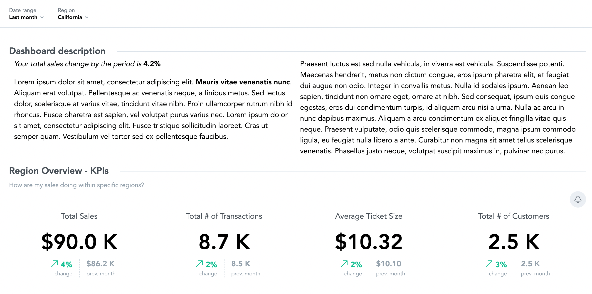

# 1. Plugin - Dashboard description

This plugin adds a textual description on top of the dashboard it's applied to. The description text is loaded
from
a separate JSON file, so you can reuse same plugin build across different dashboards and simply provide a
different URL
to the JSON file when linking the plugin to the dashboard.



You can use Markdown to format the description text and even inject live metrics into the text. The metrics
will
respect the global dashboard filters, i.e. update whenever a filter state is changed. To inject a metric,
simply use
inline code with a specific syntax: `metric:<name of the metric>` and define corresponding metric object
reference in
a "metrics" section of the JSON configuration. See example of such configuration
in [texts.json](src/dp_dashboard_description_plugin/texts.json) file.

## How to work with dashboard-description plugin

1. Clone [dashboard-plugin-examples repository](https://github.com/gooddata/gooddata-plugin-examples)
2. Navigate to `dashboard-description-plugin`
3. Make sure you have your `.env` and `.env.secrets` files with correct values.
   See [development guide](#Plugin development guide) section.
4. Make sure that dependencies in `package.json` file are aligned with the version of SDK dashboard component
   you use in your project.
5. Build a production version of the plugin with command `npm run build-plugin` or for
   yarn, `yarn build-plugin`. If you have this plugin already built, delete the `dist` folder first.
6. Upload built plugin to your hosting.
   See [limitations for the hosting](https://sdk.gooddata.com/gooddata-ui/docs/dashboard_plugins.html#current-limitations)
7. Create plugin MD object with `yarn add-plugin` command. For more information run
   the `yarn add-plugin --help` command. Remember or copy the plugin object id noted in the console output.
8. Link the plugin to dashboard with the id set up in `.env` file
   with `yarn link-plugin -- <plugin-obj-id> --with-parameters` command. This will open the text editor where
   you paste a **Configuration JSON** file with link to a file with the texts(**Texts JSON**), and optionally
   IDs and positions of texts if you want to show only certain texts on a particular dashboard.

## Configuration files

Examples of the **Configuration JSON** and **Texts JSON** files below.

### Configuration JSON

* **Configuration JSON** is an object that is passed to the Plugin as a parameter either when linking
  the plugin with a dashboard(see step no. 8 above), or when editing plugin parameters via dashboard Grey
  pages.

```json5
{
    url: "https://www.myHosting.com/texts.json",
    texts: {
        description1: 0,
        description3: 2,
    }
}
```

**Configuration JSON fields:**

* `url`: MANDATORY, a link to publicly accessible JSON file with texts definition(s).


* `texts`: OPTIONAL, key-value pairs of text ids(_keys in Texts JSON_) with a number describing **section
  index** where to add the section with text on the dashboard.  
  If `texts` field is omitted, all texts from the **Texts JSON** will be shown in the dashboard.


* NOTE: For convenience reasons, the **Configuration JSON** file can be defined in the JSON5 format to avoid
  working
  with tricky quotes escaping when editing Plugin params via Grey pages. See [JSON5](https://json5.org/)
  documentation for more details.

### Texts JSON

* **Texts JSON** is the file with text definitions stored in a publicly accessible hosting. It contains
  key-value pairs with textIDs as keys and description texts definitions as values.

```json
{
    "description1": {
        "description": "**Markdown-formatted** text with all **OPTIONAL** fields defined, including the live *metrics*, like this: `metric:my_metric_1`, `metric:my_metric_2`",
        "metrics": {
            "my_metric_1": {
                "uri": "/gdc/md/qw8s898l8cssqd1tnkw6zv03zznx9ql1/obj/544"
            },
            "my_metric_2": {
                "identifier": "aab4IL8XyNnh"
            }
        },
        "dateDataSet": {
            "uri": "/gdc/md/qw8s898l8cssqd1tnkw6zv03zznx9ql1/obj/431"
        },
        "sectionIndex": 1,
        "sectionTitle": "Dashboard description",
        "grid": {
            "width": 6,
            "height": 2
        },
        "wrap": false
    },
    "description2": {
        "description": "A valid description with the only **MANDATORY** field, *description*"
    },
    "description3": {
        "description": "Another description with the **OPTIONAL** Section title",
        "sectionTitle": "Description 3 section title"
    }
}

```

**Description definition fields in Texts JSON:**

* `description`: MANDATORY, the own text of the description in **Markdown** format.


* `metrics`: OPTIONAL, key-value pairs of metrics used in the description text. Value should be an Object
  Reference to the metric. Object reference can be in form of `uri` or `identifier` of the respective metric.


* `dateDataSet`: OPTIONAL, provide when using live `metrics`. It is needed so that live metrics would respect
  date filters of your dashboard. Similar to `metrics`, it can be provided as an `uri` or `identifier`.

* `sectionIndex`: OPTIONAL, defaults to `0`. Each description will add a new section to the dashboard. This is
  the indexed position(starting from `0`) of the section within the dashboard.


* `sectionTitle`: OPTIONAL, the title of the section with the description. If left out, the section will be
  added without a title.


* `grid`: OPTIONAL, on object with `width` and `height` properties(both OPTIONAL). Both are expecting number
  values. Width should be a number between 1 and 12 and represents the number of dashboard grid columns the
  text will take. Height defines the number of dashboard grid rows the description will take. Defaults
  to `{ width: 12, height: 1 }`


* `wrap`: OPTIONAL, `true`/`false` value, defaults to `true`. With wrap setting on, the description text will
  be wrapped into two columns.

For TypesScript types definitions,
see [interface.ts file](src/dp_dashboard_description_plugin/component/interface.ts).

---

# 2. General plugin documentation

## Quick Introduction into Dashboard Plugins

Dashboard Plugins (plugins) allow developers to create extensions that alter behavior and look and feel of the
vanilla GoodData KPI Dashboards (dashboards).

Plugins are registered into the dashboard engine used to render a concrete dashboard. At the registration time
the
plugin code can use several customization APIs to:

- deliver new custom widgets to render on the dashboard
- alter how particular insights are rendered; this in effect allows you to inject custom data visualizations
  of
  analytics computed by GoodData
- listen to events occurring on the dashboard

When developing your own plugin, you typically create custom React components and event handlers that interact
with
the rendered dashboard using available APIs and then register those components and handlers using the
customization APIs.

The infrastructure within this project allows you to develop and verify your new plugin against a live,
existing dashboard
located either on GoodData platform or GoodData.CN.

Once you are happy with your new plugin you have to build it using scripts included in this project and then
host
the built artifacts.

After that, you can register the plugin into one or more workspaces on GoodData platform and/or GoodData.CN
and
then use the plugin on any number of dashboards

_Note: GoodData currently does not provide hosting for your plugin artifacts._

## Plugin development guide

Building a new plugin is easy. Before you start, ensure that your `.env` and `.env.secrets` files are set up
correctly.

1. Start the development server: `npm start`

   To verify everything works correctly, navigate to `https://127.0.0.1:3001`. You should see your existing
   dashboard with a new empty section added at the end. The section will be titled 'Added from a plugin'.

   Note: you can use `PORT` env variable to specify different port number.

2. Develop your plugin code in `src/dp_dashboard_description_plugin`

   The `src/dp_dashboard_description_plugin/Plugin.tsx` is the main plugin file where you have to register all
   your custom content. However, you can create as many new files as you want under
   the `src/dp_dashboard_description_plugin`
   directory. Just make sure to never place your custom code outside of this directory.

   Note: we recommend to write your plugin in TypeScript and to use a modern IDE. This way you can
   conveniently
   explore the plugin customization APIs from the comfort of your development environment.

3. Build the plugin: `npm run build-plugin`

   This will build plugin artifacts under `dist/dashboardPlugin`.

4. Upload plugin artifacts to your hosting

   It is paramount that you upload all files from the `dist/dashboardPlugin`.

   _IMPORTANT_: your hosting must support https and your GoodData domain must include the hosting location in
   the list
   of allowed hosts from where GoodData will load plugins. You should create
   a [support ticket](https://support.gooddata.com/hc/en-us/requests/new?ticket_form_id=582387) to explicitly
   allow the hosting
   location before we will load any plugins from it. You may host multiple plugins in separate directories
   within
   the allowed hosting location.

   _GOOD IDEA_: treat plugin builds immutably. Never overwrite an already uploaded plugin artifacts. Organize
   your hosting
   location so there is always unique directory that contains all plugin artifacts. This is a corner-stone of
   controlled,
   phased rollout of the plugin.

   _BAD IDEA_: overwriting existing plugin artifacts will immediately impact all dashboards that use the
   plugin, possibly
   breaking them if you did not have chance to fully test the plugin.

5. Add plugin to one or more workspaces: `npm run add-plugin -- <url>`

   Once your plugin is uploaded to public hosting location, you can add it into your workspace. You can
   achieve this
   using the same CLI tool that you have used to create this plugin project. For convenience, this project
   contains
   the tool among the devDependencies together with convenience script to add plugin to either workspace
   specified
   in your `.env` file (default) or another workspace that you specify on the command line.

   Run
   the `npm run add-plugin -- "https://your.hosting/pluginDirOfYourChoice/dp_dashboard_description_plugin.js"`
   to
   create a new dashboard plugin object in the workspace specified in the `.env` file. The created dashboard
   object
   point to the URL of the built plugin.

   After successful creation of the plugin object, the tool will print plugin object identifier. You will need
   this
   identifier later to link dashboard(s) with the plugin.

   Note: the CLI tool has options that allow you to add plugin to different backends and/or different
   workspaces. Check out
   `npm run gdc-plugins -- --help` to learn more about the tool's commands and options.

6. Use plugin on a dashboard: `npm run link-plugin -- <plugin-object-id>`

   Now that you have created a plugin object in your workspace, you can link it with one or more dashboards.
   The
   `link-plugin` script in package.json is a shortcut to link plugin with dashboard specified in your `.env`
   file.

   If your plugin supports parameterization (
   see [src/dp_dashboard_description_plugin](src/dp_dashboard_description_plugin/Plugin.tsx)) and
   you want to specify parameters for the link between dashboard the plugin, you can
   run `npm run link-plugin -- <plugin-object-id> --with-parameters`
   and the tool will open an editor for you to enter the parameters.

   Note: the CLI tool has options that allow you to link plugin to different backends and/or different
   workspaces. Check out
   `npm run gdc-plugins -- --help` to learn more about the tool's commands and options.

   _TIP_: you can use the `unlink` command to remove the link between dashboard and the plugin.

## Authentication & secrets

Your plugin does not have to concern itself with the authentication against GoodData backend. When the plugin
runs
in context of GoodData KPI Dashboards, it is the application that takes care of all the authentication and
ensures
that the plugin executes in an authenticated environment.

The authentication credentials that are required to start the development harness included in this project are
used
only during development because the harness needs to provide authenticated environment to the plugin as well.

In order to provide credentials to the development harness, you can use either the `.env.secrets` file or
export the
necessary environment variables before starting the harness.

The contents of `.env.secrets` will never make their way into plugin build artifacts, they are loaded only
when starting
the development harness. Check out the webpack.config.js if you would like to double-check this.

_IMPORTANT: Never include credentials and secrets in your plugin source code or other assets that your plugin
requires.
All this data will be available in the publicly hosted plugin artifacts and can also be found through the
browser developer console._

## FAQ

### What's up with the directories in src? Can I rename them?

Do not rename or otherwise refactor any of the directories that were created during this project
initialization.
The structure and naming are essential for the build and the runtime loading of your plugin to work properly.

This project is setup so that all your custom code must be self-contained in
the [src/dp_dashboard_description_plugin](src/dp_dashboard_description_plugin) directory.

The [src/dp_dashboard_description_plugin\_engine](src/dp_dashboard_description_plugin_engine)
and [src/dp_dashboard_description_plugin\_entry](src/dp_dashboard_description_plugin_entry) directories
contain essential plugin boilerplate.
You should not modify these directories or their contents unless you are 100% sure what you are doing.

The [src/harness] directory contains code for plugin development harness; it is used only during plugin
development and the
code in this directory will not be part of the plugin build. You can start the harness using `npm start`.
You should have no need to modify the code in the harness. We anticipate that at times you may need to tweak
Analytical Backend setup
that is contained in the [src/harness/backend.ts](src/harness/backend.ts) - this is a safe change.

### How can I setup compatibility of the plugin?

You can modify minEngineVersion and maxEngineVersion properties
in `src/dp_dashboard_description_plugin\_entry/index`.
By default, we guarantee that plugin will be compatible only with the exact version of the dashboard engine
used during its build (`"bundled"` option). But if you are sure, that plugin is compatible also with the other
engine versions, you can set concrete range of the versions (
e.g. `"minEngineVersion": "8.8.0", "maxEngineVersion": "8.9.0"`). Note that combining multiple plugins created
before version `8.8.0` may not work.

### How do plugin dependencies work?

Your plugin can depend on arbitrary third party packages at your discretion with one exception: the packages
specified as `peerDependencies` in this project's package.json. Packages that are listed as `peerDependencies`
will be _provided_ by the runtime environment.

### Can I modify webpack config?

This is generally not recommended and if needed should be approached by expert users only. In general, adding
new
loaders and _extending_ the resolve section are the safer types of changes. However we strongly discourage
making
modifications to other parts of the webpack config: changes to how the `dashboardPlugin` is built can break
your
plugin and prevent it from loading correctly.

### How about Internet Explorer?

GoodData
applications [do not support Internet Explorer](https://help.gooddata.com/pages/viewpage.action?pageId=86775029)
as of November 19th 2021.
The plugin artifacts created during the plugin build are not compatible with Internet Explorer.

### How about Safari?

GoodData applications do support Safari, however currently it's not possible to run this boilerplate locally
with GoodData.CN backend running on https protocol, due to the fact how Safari is handling authentication in
backend redirects.

## License

The Plugin can be utilized under the BSD-3 Clause License. For more details, please refer to the main LICENSE file available at ('../LICENSE')[LICENSE].

