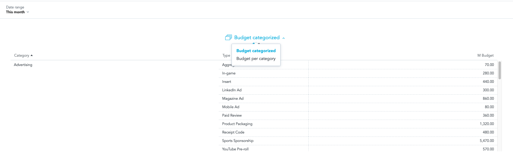

# GoodData.UI Dashboard Plugin - insight groups plugin

The plugin is grouping multiple widgets into one group. The current selected widget can be selected with the new dropdown bubble in the widget header.



## How to work with insight groups plugin

1. Clone [dashboard-plugin-examples repository](https://github.com/gooddata/gooddata-plugin-examples).
1. Navigate to `insight_groups_plugin`.
1. Make sure you have your `.env` and `.env.secrets` files with correct values. See [development guide](#plugin-development-guide) section.
1. Make sure that dependencies in `package.json` file are aligned with the version of SDK dashboard component you use in your project.
1. Install the dependencies (`npm install` or `yarn install`)
1. Build a production version of the plugin with command `npm run build-plugin` or for yarn, `yarn build-plugin`. If you have this plugin already built, delete the `dist` folder first.
1. Upload built plugin to your hosting. See [limitations for the hosting](https://sdk.gooddata.com/gooddata-ui/docs/dashboard_plugins.html#current-limitations).
1. Create plugin MD object with `yarn add-plugin` command. For more information run the `yarn add-plugin --help` command. Remember or copy the plugin object id noted in the console output.
1. Link the plugin to dashboard with the id set up in `.env` file with `yarn link-plugin -- <plugin-obj-id>` command.

> Optional: There's an extra `sync-plugin` command in the `src/package.json` that uploads the plugin to an S3 bucket. It requires [s3cmd](https://s3tools.org/s3cmd) CLI and `src/.s3cmd` with bucket credentials config to work.

### Configuration

See `src/harness/PluginLoader.tsx` to configure the plugin during the development process. The plugin configuration is defined via stringified JSON (`JSON.stringify()`) in the following format (note, you'll need to strip comments to make it a valid JSON):

```json5
{
    //root key is group name, can be random, is not visible anywhere
    "groupName1": [
        //list of all insights identifiers in group
        "insightIdentifier1",
        "insightIdentifier2"
    ],
    "groupName2": [
        "insightIdentifier3",
        "insightIdentifier4",
        "insightIdentifier5"
    ]
}
```

When the plugin is linked to a dashboard (`analyticalDashboard` metadata object) on the GoodData Platform, the `analyticalDashboard.plugins[].parameters` property should include the plugin configuration.

When the plugin is linked to a dashboard (`analyticalDashboard` metadata object) on the GoodData Cloud or GoodData.CN, the `analyticalDashboard.data.attributes.content.plugins[].plugin.parameters` property should include the plugin configuration.

See "plugin parameterization" and `npm run link-plugin -- <plugin-object-id> --with-parameters` below for more information.
### Implementation details
The current plugin API does not allow hiding of widgets and layout modifications
in real time, which would be needed for clean implementation.

To be able to hide layout widgets, the low level browser API is used. See `setColumnVisibilityByChildId` for more detail.

Also, the current state of the code does not allow to use the `useTheme` hook, so the existing css variables derived from theme values are used.
Look for the use of`var(--gd- ...` to find the places of CSS variables usage.

## Quick Introduction into Dashboard Plugins

Dashboard Plugins (plugins) allow developers to create extensions that alter behavior and look and feel of the
vanilla GoodData KPI Dashboards (dashboards).

Plugins are registered into the dashboard engine used to render a concrete dashboard. At the registration time the
plugin code can use several customization APIs to:

-   deliver new custom widgets to render on the dashboard
-   alter how particular insights are rendered; this in effect allows you to inject custom data visualizations of
    analytics computed by GoodData
-   listen to events occurring on the dashboard

When developing your own plugin, you typically create custom React components and event handlers that interact with
the rendered dashboard using available APIs and then register those components and handlers using the customization APIs.

The infrastructure within this project allows you to develop and verify your new plugin against a live, existing dashboard
located either on GoodData platform or GoodData.CN.

Once you are happy with your new plugin you have to build it using scripts included in this project and then host
the built artifacts.

After that, you can register the plugin into one or more workspaces on GoodData platform and/or GoodData.CN and
then use the plugin on any number of dashboards

_Note: GoodData currently does not provide hosting for your plugin artifacts._

## Plugin development guide

Building a new plugin is easy. Before you start, ensure that your `.env` and `.env.secrets` files are set up correctly.

0.  (Optional) Export catalog: `npm run refresh-md`

    To make referencing various metadata objects easier in your plugin, you can use the [Export catalog](https://sdk.gooddata.com/gooddata-ui/docs/export_catalog.html) feature to get a easy-to-use list of the various MD objects in your workspace (insights, dashboards, attributes, etc.).
    For convenience, this was integrated to your plugin, just run `npm run refresh-md`.
    This will connect to the workspace specified in the `.env` file using the credentials from `.env.secrets`
    and populate the file `src/md/full.ts` with information about the metadata objects available in the specified workspace.
    See the [Export catalog](https://sdk.gooddata.com/gooddata-ui/docs/export_catalog.html) documentation page for more information.

1.  Start the development server: `npm start`

    To verify everything works correctly, navigate to `https://127.0.0.1:3001`. You should see your existing
    dashboard with a new empty section added at the end. The section will be titled 'Added from a plugin'.

    Note: you can use `PORT` env variable to specify different port number.

2.  Develop your plugin code in `src/dp_insight_groups`

    The `src/dp_insight_groups/Plugin.tsx` is the main plugin file where you have to register all
    your custom content. However, you can create as many new files as you want under the `src/dp_insight_groups`
    directory. Just make sure to never place your custom code outside of this directory.

    Note: we recommend to write your plugin in TypeScript and to use a modern IDE. This way you can conveniently
    explore the plugin customization APIs from the comfort of your development environment.

3.  Build the plugin: `npm run build-plugin`

    This will build plugin artifacts under `esm/dashboardPlugin`.

4.  Upload plugin artifacts to your hosting

    It is paramount that you upload all files from the `esm/dashboardPlugin`.

    _IMPORTANT_: your hosting must support https, allow CORS to your GoodData domain and your GoodData domain must include the hosting location in the list
    of allowed hosts from where GoodData will load plugins. You should create a [support ticket](https://support.gooddata.com/hc/en-us/requests/new?ticket_form_id=582387) to explicitly allow the hosting
    location before we will load any plugins from it. You may host multiple plugins in separate directories within
    the allowed hosting location.

    _GOOD IDEA_: treat plugin builds immutably. Never overwrite an already uploaded plugin artifacts. Organize your hosting
    location so there is always unique directory that contains all plugin artifacts. This is a corner-stone of controlled,
    phased rollout of the plugin.

    _BAD IDEA_: overwriting existing plugin artifacts will immediately impact all dashboards that use the plugin, possibly
    breaking them if you did not have chance to fully test the plugin.

5.  Add plugin to one or more workspaces: `npm run add-plugin -- <url>`

    Once your plugin is uploaded to public hosting location, you can add it into your workspace. You can achieve this
    using the same CLI tool that you have used to create this plugin project. For convenience, this project contains
    the tool among the devDependencies together with convenience script to add plugin to either workspace specified
    in your `.env` file (default) or another workspace that you specify on the command line.

    Run the `npm run add-plugin -- "https://your.hosting/pluginDirOfYourChoice/dp_insight_groups.js"` to
    create a new dashboard plugin object in the workspace specified in the `.env` file. The created dashboard object
    point to the URL of the built plugin.

    After successful creation of the plugin object, the tool will print plugin object identifier. You will need this
    identifier later to link dashboard(s) with the plugin.

    Note: the CLI tool has options that allow you to add plugin to different backends and/or different workspaces. Check out
    `npm run gdc-plugins -- --help` to learn more about the tool's commands and options.

6.  Use plugin on a dashboard: `npm run link-plugin -- <plugin-object-id>`

    Now that you have created a plugin object in your workspace, you can link it with one or more dashboards. The
    `link-plugin` script in package.json is a shortcut to link plugin with dashboard specified in your `.env` file.

    If your plugin supports parameterization (see [src/dp_insight_groups](./src/dp_insight_groups/Plugin.tsx)) and
    you want to specify parameters for the link between dashboard the plugin, you can run `npm run link-plugin -- <plugin-object-id> --with-parameters`
    and the tool will open an editor for you to enter the parameters.

    Note: the CLI tool has options that allow you to link plugin to different backends and/or different workspaces. Check out
    `npm run gdc-plugins -- --help` to learn more about the tool's commands and options.

    _TIP_: you can use the `unlink` command to remove the link between dashboard and the plugin.

7.  Update plugin parameters on a dashboard: `npm run update-plugin-params -- <plugin-object-id>`

    This command is useful if you want to change or add the parameters in the already linked plugin. The tool will open an editor for you to enter the new parameters.

8.  Remove plugin parameters on a dashboard: `npm run remove-plugin-params -- <plugin-object-id>`

    This command is useful if you want to remove the parameters in the already linked plugin.

## Authentication & secrets

Your plugin does not have to concern itself with the authentication against GoodData backend. When the plugin runs
in context of GoodData KPI Dashboards, it is the application that takes care of all the authentication and ensures
that the plugin executes in an authenticated environment.

The authentication credentials that are required to start the development harness included in this project are used
only during development because the harness needs to provide authenticated environment to the plugin as well.

In order to provide credentials to the development harness, you can use either the `.env.secrets` file or export the
necessary environment variables before starting the harness.

The contents of `.env.secrets` will never make their way into plugin build artifacts, they are loaded only when starting
the development harness. Check out the webpack.config.js if you would like to double-check this.

_IMPORTANT: Never include credentials and secrets in your plugin source code or other assets that your plugin requires.
All this data will be available in the publicly hosted plugin artifacts and can also be found through the browser developer console._

## FAQ

### What's up with the directories in src? Can I rename them?

Do not rename or otherwise refactor any of the directories that were created during this project initialization.
The structure and naming are essential for the build and the runtime loading of your plugin to work properly.

This project is setup so that all your custom code must be self-contained in the [src/dp_insight_groups](./src/dp_insight_groups) directory.

The [src/dp_insight_groups_engine](./src/dp_insight_groups_engine) and [src/dp_insight_groups_entry](./src/dp_insight_groups_entry) directories contain essential plugin boilerplate.
You should not modify these directories or their contents unless you are 100% sure what you are doing.

The [src/harness] directory contains code for plugin development harness; it is used only during plugin development and the
code in this directory will not be part of the plugin build. You can start the harness using `npm start`.
You should have no need to modify the code in the harness. We anticipate that at times you may need to tweak Analytical Backend setup
that is contained in the [src/harness/backend.ts](src/harness/backend.ts) - this is a safe change.

### How can I setup compatibility of the plugin?

You can modify minEngineVersion and maxEngineVersion properties in `src/dp_insight_groups\_entry/index`.
By default, we guarantee that plugin will be compatible only with the exact version of the dashboard engine used during its build (`"bundled"` option). But if you are sure, that plugin is compatible also with the other engine versions, you can set concrete range of the versions (e.g. `"minEngineVersion": "8.8.0", "maxEngineVersion": "8.9.0"`). Note that combining multiple plugins created before version `8.8.0` may not work.

### How do plugin dependencies work?

Your plugin can depend on arbitrary third party packages at your discretion with one exception: the packages
specified as `peerDependencies` in this project's package.json. Packages that are listed as `peerDependencies`
will be _provided_ by the runtime environment.

### Can I modify webpack config?

This is generally not recommended and if needed should be approached by expert users only. In general, adding new
loaders and _extending_ the resolve section are the safer types of changes. However we strongly discourage making
modifications to other parts of the webpack config: changes to how the `dashboardPlugin` is built can break your
plugin and prevent it from loading correctly.

### How about Internet Explorer?

GoodData applications [do not support Internet Explorer](https://help.gooddata.com/pages/viewpage.action?pageId=86775029) as of November 19th 2021.
The plugin artifacts created during the plugin build are not compatible with Internet Explorer.

### How about Safari?

GoodData applications do support Safari, however currently it's not possible to run this boilerplate locally with GoodData.CN backend running on https protocol, due to the fact how Safari is handling authentication in backend redirects.

## License

The Plugin can be utilized under the BSD-3 Clause License. For more details, please refer to the main LICENSE file available at ('../LICENSE')[LICENSE].
