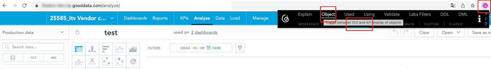
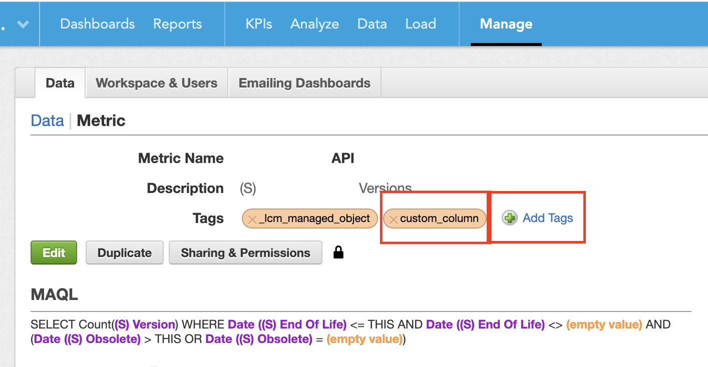
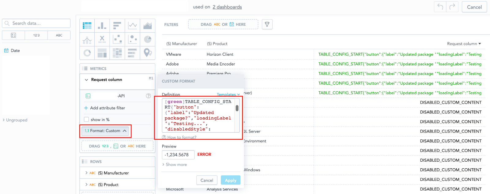

# 1. Insight To Action
> Pivot table with button for API calls. This plugin is located in the legacy folder because it uses 
> the Pivot table from the GoodData SDK. Although it is not recommended to copy the SDK component to modify it, 
> in this case there is no other reasonable solution.

## How to work with Insight To Action Plugin

1. Clone this repository
2. Navigate to `legacy_plugins/whitelabelling_bar`
3. Provide backend, workspace and dashboard in `.env`
4. Rename `.env.secrets.template` to `.env.secrets` and provide your preferred way of authentication
5. Install dependencies (`npm install` or `yarn install`)
6. See instructions below how to build, deploy, and use this plugin

## Configuration

---

### Insight tag “custom_table”

Once you will prepare insight where you want to use the dashboard plugin, you need to add a special tag to this insight.

#### for Gooddata CN/Cloud
To add the tag to your insight you need to perform the `PUT` request ([check api reference here](https://www.gooddata.com/docs/cloud/api-and-sdk/api/api_reference_all/#operation/updateEntity@VisualizationObjects)):

`/api/v1/entities/workspaces/{workspaceId}/visualizationObjects/{objectId}`

Add `"custom_table"` tag to the `tags` array (if it doesn't exist, just simply add it) which is located
under `attributes` property and perform request.

To get current visualization object you can use next api (You can check details [here](https://www.gooddata.com/docs/cloud/api-and-sdk/api/api_reference_all/#operation/getEntity@VisualizationObjects)):

`/api/v1/entities/workspaces/{workspaceId}/visualizationObjects/{objectId}`

Then you can use the response of this request as the body of your `PUT` request and add the tag as described above.

You also can fetch all the visualization objects by using this endpoint ([api reference here](https://www.gooddata.com/docs/cloud/api-and-sdk/api/api_reference_all/#operation/getAllEntities@VisualizationObjects)):
`/api/v1/entities/workspaces/{workspaceId}/visualizationObjects`

#### for Gooddata Platform

The easiest way to add the tag is to use the
[GD Google Chrome Extension](https://chrome.google.com/webstore/detail/gooddata-extension-tool/ifcamcjkflbbalnmnbnlkiehbieknjog).

Open your insight in Analyzer.
In the GD extension please select the `Object` tab and then click on `Object`.



Metadata of the opened insight will be opened, for example:

https://example.on.gooddata.com/gdc/md/uu9dh2agn9djsadususdj6xcye4oox25d/obj/7

To edit the metadata you need to add the special parameter into the url: `?mode=edit`.
The final url will look like this:

https://example.on.gooddata.com/gdc/md/uu9dh2agn9djsadususdj6xcye4oox25d/obj/7?mode=edit

In this mode you can edit and the only thing which you need to do is to add the `custom_table` tag into the section with tags.
For example if the tag section looks like this:

```text
  "tags": "_lcm_managed_object"
```

you will add the tag and the final value will be:
```text
  "tags": "_lcm_managed_object custom_table"
```
Then all you have to do is to save the change and the insight is newly tagged.

---

### Metric tag “custom_column”
#### for Gooddata CN/Cloud

You need to add `"custom_column"` tag to your column/metric that will be replaced by the action button.
To add tag to the metric you need to perform `PUT` request ([api reference here](https://www.gooddata.com/docs/cloud/api-and-sdk/api/api_reference_all/#operation/updateEntity@Metrics)):

`/api/v1/entities/workspaces/{workspaceId}/metrics/{objectId}`

Add `"custom_column"` tag to the `tags` array (if it doesn't exist, just simply add it) which is located under `attributes` property and perform request.

To get your metric object to perform `PUT` request, you can use the next api ([api reference here](https://www.gooddata.com/docs/cloud/api-and-sdk/api/api_reference_all/#operation/getEntity@Metrics)):

`/api/v1/entities/workspaces/{workspaceId}/metrics/{objectId}`

Then you can use the response of this request as the body of your `PUT` request and add the tag as described above.

You also can fetch all the metrics by using this endpoint ([api reference here](https://www.gooddata.com/docs/cloud/api-and-sdk/api/api_reference_all/#operation/getAllEntities@Metrics)):
`/api/v1/entities/workspaces/{workspaceId}/metrics`


#### for Gooddata Platform
Next setting will define which column/metric will be replaced by the final button.
Here the only thing which you need to do is open the metric from the “Manage” section and manually add the tag.



---

### Configuration json structure in the metric format
#### for Gooddata Platform and Gooddata CN/Cloud
Fill the format with configuration json structure for the button.
You can set it directly in Analyzer on the metric which you want to replace with the button.
The details of the json configuration will be described below in another section.



---

### Dashboard plugin in the selected dashboard
You need to tell the exact dashboard that exactly on this dashboard the plugin will run.
Basically it is enough to set it in one workspace/dashboard and then once it is already set you can only copy the
metadata part from one dashboard to another one.

The process is similar as is described **Insight tag “custom_table”** section of this document.
You will open metadata of the dashboard where the plugin is already used, then you will copy the part “plugins”.
In the new dashboard where you want to use the plugin, you will again open the metadata, and you will past the “plugins”
part which you copied in the previous step.

Then the new dashboard should be set to use the plugin.

---

### Setting of dashboardPluginHosts

#### for Gooddata CN/Cloud
Update the Content Security Policy of your GoodData Cloud instance’s gateway to enable loading plugins from the hosting location.
https://www.gooddata.com/docs/gooddata-ui/latest/references/dashboard_component/dashboard_plugins/#DashboardPlugins-ConfigurationonGoodDataCloud

#### for Gooddata CN/Cloud
Prepare support ticket with requirement on the setting of feature flag dashboardPluginHosts = {path to the plugin}, for example https://example.s3.us-south-5.amazonaws.com/dashboardPlugin/dp_insight_to_action.js

---

### Configuration specifics for the GoodData Platform

#### Feature flag dashboardComponentDevRollout
Set feature flag dashboardComponentDevRollout = true over the domain. This should be able to be set from the domain
admin account.

`https://{{domain_url}}/gdc/domains/{{domain_id}}/config`

---

#### Details and tips are available in GD documentation:
https://sdk.gooddata.com/gooddata-ui/docs/dashboard_plugins.html

---

## Configuration metric format
In section **Configuration json structure in the metric format** is described how to add formatting directly to the insight. Here you will see all possibilities of this configuration structure.

### Configuration start/end
The configuration for the plugin always has to start with `TABLE_CONFIG_START` and end with `TABLE_CONFIG_END`

---

### GD standard formatting is replaced by plugin formatting.
You can combine standard GD formatting with plugin formatting but the plugin formatting will always replace the standard GD formatting.
That means that the plugin formatting under some condition also influences the rest of the conditions.

For example in this setting:

```text
[<0][red]ERROR;
[<10][black]DISABLED_CUSTOM_CONTENT;
[>=10][green]TABLE_CONFIG_START{"button":{"label":"Request Package","loadingLabel":"Sending...", 
"disabledStyle": {"backgroundColor": "blue"}},
"request":{"method":"POST", "endpointName": "example", 
"uri":"https://example.com/api/v1/?param1=r_1&param2=r_0&paramWithVariable=example-r_username"},
"alert":{"title":"r_1"}}TABLE_CONFIG_END
```
The plugin will also replace values `ERROR` and `DISABLED_CUSTOM_CONTENT`.

---

### Enhancements/Possibilities within the plugin

Here you can see all possible changes which you can do within the plugin configuration metric format:
*(All arrays “{}” can contain CSSProperties.)*

```yaml
{
  "alert": {                    -> Error/success message that pops up after sending data
    "title": "",                -> Title
    "errorMessage": "",         -> Text below the title for unsuccessful submission
    "successMessage": "",       -> Text below the title for successful submission
    "successStyle": {},         -> Style of the successful submission 
    "errorStyle": {},           -> Style of the unsuccessful submission 
    "bodyVariable": ""          -> Variable value for errorMessage/successMessage, only reference on existing report column like r_0, r_1
  },
  "button": {                   -> Button settings
    "label": "",                -> Name for enabled button
    "disabledLabel": "",        -> Name for disabled button
    "loadingLabel": "",         -> Name of the button that appears while sending data
    "style": {},                -> Style for enabled button
    "disabledStyle": {},        -> Style for disabled button
    "width": number             -> Set button width
  },
  "request": {                  -> Details for final request
    "endpointName": "",         -> Name of the endpoint to which the request is sent
    "method": "",               -> REST methods (POST/PUT/PATCH/DELETE)
    "Uri": "",                  -> Url address
    "disableErrors": boolean    -> Possibility to disable error messages
  },
  "modal": {                    -> Window that pops up when you click the submit button
    "disabled": boolean,        -> Hiding of this window
    "title": "",                -> Name in the modal header
    "body": "",                 -> Name in the modal body
    "style": {}                 -> Style for modal window
  }
}
```

---

### Example of configuration metric format
```text
[<0][red]ERROR;
[=0][black]DISABLED_CUSTOM_CONTENT;
[>0][green]TABLE_CONFIG_START
{
	"button": {
		"label": "Request Package",
		"disabledLabel": "Latest Version",
		"loadingLabel": "Sending...",
		"width": 150,
		"style": {
			"backgroundColor": "#00A1DE",
      			"borderColor": "white",
      			"color": "white",
      			"cursor": "grab"
		},
		"disabledStyle": {
			"backgroundColor": "#003366",
      			"borderColor": "#c70000",
      			"color": "#c70000",
      			"cursor": "not-allowed"
		}
	},
	"request": {
		"method": "POST",
		"endpointName": "example",
		"uri": "https://example.com/api/v1/?param1=r_1&param2=r_0&paramWithVariable=example-r_username",
		"disableErrors": true
	},
  	"alert": {
    		"title": "SUCCESS",
    		"bodyVariable": "r_1"
  	},
  	"modal": {
    		"disabled": false
  	}
}
TABLE_CONFIG_END
```

---

## Plugin usage with LCM within client workspaces
Once the new dashboard will be ready, you will probably need to propagate this change into the client workspaces.
Because the plugin propagation is compatible with GD Lifecycle Management (LCM) then the change is simply doable via
standard Release/Rollout/Provisioning processes without any other effort.

However, you must not forget that the plugin must be enabled and registered in the domain where we will propagate it
(Configuration on the GoodData platform).

---

# 2. General plugin documentation

## GoodData.UI Dashboard Plugin project

This is a one-stop project to help you develop, test and build your own dashboard plugin. Before you start, we
encourage you to learn more about plugins
in [our documentation](https://sdk.gooddata.com/gooddata-ui/docs/about_gooddataui.html).

In case you don't feel like reading the documentation at this point, go at least through the following quick
introduction.

## Quick Introduction into Dashboard Plugins

Dashboard Plugins (plugins) allow developers to create extensions that alter behavior and look and feel of the
vanilla GoodData KPI Dashboards (dashboards).

Plugins are registered into the dashboard engine used to render a concrete dashboard. At the registration time the
plugin code can use several customization APIs to:

- deliver new custom widgets to render on the dashboard
- alter how particular insights are rendered; this in effect allows you to inject custom data visualizations of
  analytics computed by GoodData
- listen to events occurring on the dashboard

When developing your own plugin, you typically create custom React components and event handlers that interact with
the rendered dashboard using available APIs and then register those components and handlers using the customization
APIs.

The infrastructure within this project allows you to develop and verify your new plugin against a live, existing
dashboard
located either on GoodData platform or GoodData.CN.

Once you are happy with your new plugin you have to build it using scripts included in this project and then host
the built artifacts.

After that, you can register the plugin into one or more workspaces on GoodData platform and/or GoodData.CN and
then use the plugin on any number of dashboards

_Note: GoodData currently does not provide hosting for your plugin artifacts._

## Plugin development guide

Building a new plugin is easy. Before you start, ensure that your `.env` and `.env.secrets` files are set up correctly.

0. (Optional) Export catalog: `npm run refresh-md`

   To make referencing various metadata objects easier in your plugin, you can use
   the [Export catalog](https://sdk.gooddata.com/gooddata-ui/docs/export_catalog.html) feature to get an easy-to-use list
   of the various MD objects in your workspace (insights, dashboards, attributes, etc.).
   For convenience, this was integrated to your plugin, just run `npm run refresh-md`.
   This will connect to the workspace specified in the `.env` file using the credentials from `.env.secrets`
   and populate the file `src/md/full.ts` with information about the metadata objects available in the specified
   workspace.
   See the [Export catalog](https://sdk.gooddata.com/gooddata-ui/docs/export_catalog.html) documentation page for more
   information.

1. Start the development server: `npm start`

   To verify everything works correctly, navigate to `https://127.0.0.1:3001`. You should see your existing
   dashboard with a new empty section added at the end. The section will be titled 'Added from a plugin'.

   Note: you can use `PORT` env variable to specify different port number.

2. Develop your plugin code in `src/dp_tooltip_plugin`

   The `src/dp_tooltip_plugin/Plugin.tsx` is the main plugin file where you have to register all
   your custom content. However, you can create as many new files as you want under the `src/dp_tooltip_plugin`
   directory. Just make sure to never place your custom code outside of this directory.

   Note: we recommend to write your plugin in TypeScript and to use a modern IDE. This way you can conveniently
   explore the plugin customization APIs from the comfort of your development environment.

3. Build the plugin: `npm run build-plugin`

   This will build plugin artifacts under `dist/dashboardPlugin`.

4. Upload plugin artifacts to your hosting

   It is paramount that you upload all files from the `dist/dashboardPlugin`.

   _IMPORTANT_: your hosting must support https and your GoodData domain must include the hosting location in the list
   of allowed hosts from where GoodData will load plugins. You should create
   a [support ticket](https://support.gooddata.com/hc/en-us/requests/new?ticket_form_id=582387) to explicitly allow the
   hosting
   location before we will load any plugins from it. You may host multiple plugins in separate directories within
   the allowed hosting location.

   _GOOD IDEA_: treat plugin builds immutably. Never overwrite an already uploaded plugin artifacts. Organize your
   hosting
   location so there is always unique directory that contains all plugin artifacts. This is a corner-stone of
   controlled,
   phased rollout of the plugin.

   _BAD IDEA_: overwriting existing plugin artifacts will immediately impact all dashboards that use the plugin,
   possibly
   breaking them if you did not have chance to fully test the plugin.

5. Add plugin to one or more workspaces: `npm run add-plugin -- <url>`

   Once your plugin is uploaded to public hosting location, you can add it into your workspace. You can achieve this
   using the same CLI tool that you have used to create this plugin project. For convenience, this project contains
   the tool among the devDependencies together with convenience script to add plugin to either workspace specified
   in your `.env` file (default) or another workspace that you specify on the command line.

   Run the `npm run add-plugin -- "https://your.hosting/pluginDirOfYourChoice/dp_tooltip_plugin.js"` to
   create a new dashboard plugin object in the workspace specified in the `.env` file. The created dashboard object
   point to the URL of the built plugin.

   After successful creation of the plugin object, the tool will print plugin object identifier. You will need this
   identifier later to link dashboard(s) with the plugin.

   Note: the CLI tool has options that allow you to add plugin to different backends and/or different workspaces. Check
   out
   `npm run gdc-plugins -- --help` to learn more about the tool's commands and options.

6. Use plugin on a dashboard: `npm run link-plugin -- <plugin-object-id>`

   Now that you have created a plugin object in your workspace, you can link it with one or more dashboards. The
   `link-plugin` script in package.json is a shortcut to link plugin with dashboard specified in your `.env` file.

   If your plugin supports parameterization (see [src/dp_insight_to_action](./src/dp_insight_to_action/Plugin.tsx)) and
   you want to specify parameters for the link between dashboard the plugin, you can
   run `npm run link-plugin -- <plugin-object-id> --with-parameters`
   and the tool will open an editor for you to enter the parameters.

   Note: the CLI tool has options that allow you to link plugin to different backends and/or different workspaces. Check
   out
   `npm run gdc-plugins -- --help` to learn more about the tool's commands and options.

   _TIP_: you can use the `unlink` command to remove the link between dashboard and the plugin.

## Authentication & secrets

Your plugin does not have to concern itself with the authentication against GoodData backend. When the plugin runs
in context of GoodData KPI Dashboards, it is the application that takes care of all the authentication and ensures
that the plugin executes in an authenticated environment.

The authentication credentials that are required to start the development harness included in this project are used
only during development because the harness needs to provide authenticated environment to the plugin as well.

In order to provide credentials to the development harness, you can use either the `.env.secrets` file or export the
necessary environment variables before starting the harness.

The contents of `.env.secrets` will never make their way into plugin build artifacts, they are loaded only when starting
the development harness. Check out the webpack.config.cjs if you would like to double-check this.

_IMPORTANT: Never include credentials and secrets in your plugin source code or other assets that your plugin requires.
All this data will be available in the publicly hosted plugin artifacts and can also be found through the browser
developer console._

## FAQ

### What's up with the directories in src? Can I rename them?

Do not rename or otherwise refactor any of the directories that were created during this project initialization.
The structure and naming are essential for the build and the runtime loading of your plugin to work properly.

This project is setup so that all your custom code must be self-contained in
the [src/dp_insight_to_action](./src/dp_insight_to_action) directory.

The [src/dp_insight_to_action\_engine](./src/dp_insight_to_action_engine)
and [src/dp_insight_to_action\_entry](./src/dp_insight_to_action_entry) directories contain essential plugin boilerplate.
You should not modify these directories or their contents unless you are 100% sure what you are doing.

The [src/harness] directory contains code for plugin development harness; it is used only during plugin development and
the
code in this directory will not be part of the plugin build. You can start the harness using `npm start`.
You should have no need to modify the code in the harness. We anticipate that at times you may need to tweak Analytical
Backend setup
that is contained in the [src/harness/backend.ts](src/harness/backend.ts) - this is a safe change.

### How can I set up compatibility of the plugin?

You can modify minEngineVersion and maxEngineVersion properties in `src/dp_tooltip_plugin\_entry/index`.
By default, we guarantee that plugin will be compatible only with the exact version of the dashboard engine used during
its build (`"bundled"` option). But if you are sure, that plugin is compatible also with the other engine versions, you
can set concrete range of the versions (e.g. `"minEngineVersion": "8.8.0", "maxEngineVersion": "8.9.0"`). Note that
combining multiple plugins created before version `8.8.0` may not work.

### How do plugin dependencies work?

Your plugin can depend on arbitrary third party packages at your discretion with one exception: the packages
specified as `peerDependencies` in this project's package.json. Packages that are listed as `peerDependencies`
will be _provided_ by the runtime environment.

### Can I modify webpack config?

This is generally not recommended and if needed should be approached by expert users only. In general, adding new
loaders and _extending_ the resolve section are the safer types of changes. However, we strongly discourage making
modifications to other parts of the webpack config: changes to how the `dashboardPlugin` is built can break your
plugin and prevent it from loading correctly.

### How about Internet Explorer?

GoodData's
applications [do not support Internet Explorer](https://help.gooddata.com/pages/viewpage.action?pageId=86775029) as of
November 19th 2021.
The plugin artifacts created during the plugin build are not compatible with Internet Explorer.

### How about Safari?

GoodData's applications do support Safari, however currently it's not possible to run this boilerplate locally with
GoodData.CN backend running on https protocol, due to the fact how Safari is handling authentication in backend
redirects.

## License

The Plugin can be utilized under the BSD-3 Clause License. For more details, please refer to the main LICENSE file available at ('../../LICENSE')[LICENSE].
